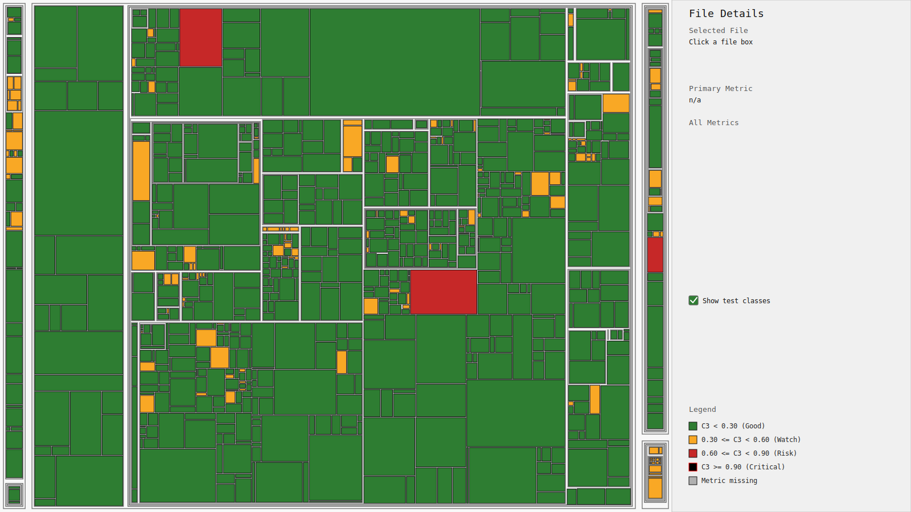

# PrioSpot

PrioSpot (Prioritize Hotspots) is a language-agnostic hotspot engine that computes C3 (churn + complexity + coverage) and generates interactive SVG treemap reports to help you visualize and prioritize hotspots in your code.

## Why This Matters

Most teams don't prioritize Tech-debt. If at all they do, they prioritize work by intuition, noisy bug reports, or whoever shouts loudest. That misses hidden risk.

PrioSpot helps you answer:
- Which files are most likely to hurt us next?
- Where should we spend refactoring/testing effort first?
- Which hotspots are risky because of low coverage, high complexity, and frequent churn together?

Why this is useful:
- Focuses engineering effort on high-risk code paths instead of broad, low-impact cleanup
- Makes refactoring prioritization objective and repeatable
- Gives a shared visual language for product, QA, and engineering discussions
- Works across large multi-module repositories with one consolidated view



## Requirements
- JDK 17+
- Gradle 8.10+ (or use wrapper)

## Quickstart (Gradle plugin)

```kotlin
plugins {
    kotlin("jvm") version "2.0.21"
    id("io.specmatic.priospot") version "1.0.0"
}

priospot {
    projectName.set("sample-kotlin-service")
    projectVersion.set("1.2.0")
    churnDays.set(30)
    outputDir.set(layout.buildDirectory.dir("reports/priospot"))
}
```

Run:

```bash
./gradlew priospot
```

Notes:
- If `sourceRoots`, `coverageReports`, or `complexityReports` are not configured, the Gradle plugin auto-discovers submodule defaults where present:
  - `src/main/kotlin`, `src/test/kotlin`
  - `build/reports/kover/report.xml`
  - `build/reports/detekt/detekt.xml`
- Missing configured coverage/complexity report files are treated as warnings; unmatched files use defaults:
  - coverage defaults to `0/1`
  - complexity defaults to `MAX-CCN=1000`

Optional explicit override (when defaults do not fit your build):

```kotlin
priospot {
    sourceRoots.set(listOf("src/main/kotlin", "src/test/kotlin"))
    coverageReports.set(listOf("build/reports/kover/report.xml"))
    complexityReports.set(listOf("build/reports/detekt/detekt.xml"))
    coverageTask.set("koverXmlReport")
    complexityTask.set("detekt")
}
```

Expected outputs in `build/reports/priospot`:

- `panopticode.json`
- `priospot-interactive-treemap.svg`
- `coverage-interactive-treemap.svg`
- `complexity-interactive-treemap.svg`
- `churn-interactive-treemap.svg`

## Quickstart (CLI)

Analyze and generate all canonical outputs:

```bash
./gradlew :cli:run --args='analyze \
  --project-name sample \
  --source-roots src/main/kotlin \
  --coverage-report build/reports/kover/report.xml \
  --complexity-report build/reports/detekt/detekt.xml \
  --churn-days 30 \
  --output-json build/reports/priospot/panopticode.json'
```

Generate a single report from existing JSON:

```bash
./gradlew :cli:run --args='report \
  --input-json build/reports/priospot/panopticode.json \
  --type priospot \
  --output-svg build/reports/priospot/priospot-interactive-treemap.svg'
```

## Modules

- `model`: canonical `panopticode.json` and `coverage.json` domain model
- `ingest-source`: source file inventory
- `ingest-churn`: git/baseline churn parser and indicators
- `ingest-coverage`: coverage normalization and merge
- `ingest-complexity`: complexity adapters and merge
- `compute-c3`: exact C3 formula implementation
- `report-svg`: interactive treemap SVG generator
- `engine`: orchestration pipeline and outputs
- `gradle-plugin`: host integration exposing a `priospot` task
- `cli`: optional `priospot` CLI (`analyze`, `report`)
- `compat-xml`: optional compatibility `panopticode.xml` exporter

## Config File Keys

Supported keys (for host integrations):

- `projectName`
- `projectVersion`
- `baseNamespace` (optional)
- `sourceRoots`
- `coverageReports`
- `complexityReports`
- `churnDays`
- `churnLog` (optional)
- `outputDir`
- `emitCompatibilityXml` (default false)
- `deterministicTimestamp` (optional)
- `coverageTask` (optional)
- `complexityTask` (optional)
- `defaultCoverageNumerator` (optional, default `0.0`)
- `defaultCoverageDenominator` (optional, default `1.0`)
- `defaultMaxCcn` (optional, default `1000`)

## Treemap UX

- File box area is proportional to file `NCSS`
- No in-box labels by default (better density at scale); names are shown on hover tooltips
- Click highlights selected file, full parent package chain, and module boundary
- Right panel shows selected file path, primary metric, and all file metrics
- Bottom-right legend explains colors for each report type (`priospot`, `coverage`, `complexity`, `churn`)

## Sample Treemaps (Good vs Problem Areas)

Use the fast sample project outputs:
- `assets/priospot-interactive-treemap.svg`
- `assets/coverage-interactive-treemap.svg`
- `assets/complexity-interactive-treemap.svg`
- `assets/churn-interactive-treemap.svg`

What "problem" looks like:
- Large box (high NCSS) + red/black in PrioSpot
- Red in coverage treemap (low coverage)
- Darker red in complexity/churn treemaps (hard-to-change + frequently changing)

What "good" looks like:
- Large box that stays green/yellow in PrioSpot
- Healthy coverage color for critical large files
- Lower complexity and churn for foundational modules

How to interpret quickly:
- Start with `priospot-interactive-treemap.svg`
- Click the largest red/black file
- Check details panel metrics
- Cross-check same file in `coverage`, `complexity`, and `churn` treemaps
- Prioritize files that are large + low coverage + high complexity + high churn

## Non-Gradle Integration Example

Node wrapper script:

```bash
node examples/node-wrapper/run-priospot.mjs analyze --help
```

## Schema

Canonical schema is available at:

- `schema/panopticode.schema.json`
